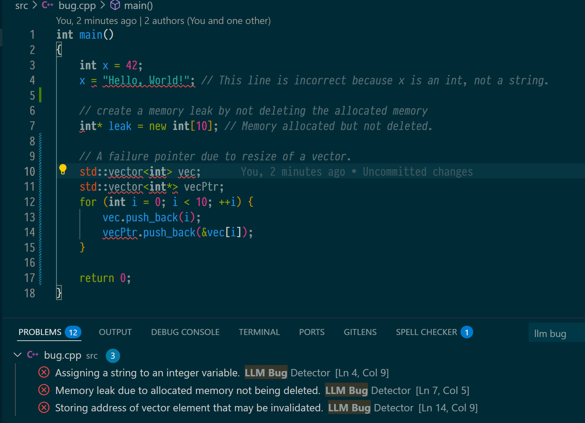

# LLM Background Diagnostics Extension

This VS Code extension automatically performs background diagnostics on currently open files using Large Language Models (LLMs).



## Installing the Extension

The extension could be installed from the VS Code Marketplace: [LLM Background Diagnostics](https://marketplace.visualstudio.com/items?itemName=zhangzhishan.llm-background-diagnostics).

## Using the Extension

Once installed and enabled, the extension will:

- Automatically analyze open files in the background if they match the configured languages (or all languages if `llmBugDetector.languages` is empty).
- After making changes to a supported file, wait for the configured delay (`llmBugDetector.analysisInterval`).
- The extension then queries the configured Large Language Model via the VS Code LLM API to identify potential issues.
- Diagnostics are displayed in the editor, highlighting potential bugs or areas for improvement from the LLM with messages like:
  - "Assigning a string to an integer variable."
  - "Storing address of vector element that may be invalidated."

**Note:** This extension relies on the VS Code Language Model API for its functionality. Ensure your VS Code version supports this API.

## Configuration

You can adjust the extension settings in VS Code User or Workspace settings under "LLM Bug Detector":

### Available Settings

- **`llmBugDetector.enabled`** (boolean, default: `true`)
  - Enables or disables the automatic background analysis

- **`llmBugDetector.model`** (string or null, default: `"gemini-2.5-pro"`)
  - Specifies the LLM model to use for analysis. If left empty, it defaults to `gemini-2.5-pro`. (This behavior is active when the VS Code API allows model selection).
  - Available Models for `llmBugDetector.model`
    - GPT 3.5 Turbo : `gpt-3.5-turbo`
    - GPT-4o mini : `gpt-4o-mini`
    - GPT 4 : `gpt-4`
    - GPT 4 Turbo : `gpt-4-0125-preview`
    - GPT-4o : `gpt-4o`
    - o1 (Preview) : `o1`
    - o3-mini : `o3-mini`
    - Claude 3.5 Sonnet : `claude-3.5-sonnet`
    - Claude 3.7 Sonnet : `claude-3.7-sonnet`
    - Claude 3.7 Sonnet Thinking : `claude-3.7-sonnet-thought`
    - Claude Sonnet 4 : `claude-sonnet-4`
    - Claude Opus 4 : `claude-opus-4`
    - Gemini 2.0 Flash : `gemini-2.0-flash-001`
    - Gemini 2.5 Pro (Preview) : `gemini-2.5-pro`
    - GPT-4.5 (Preview) : `gpt-4.5-preview`
    - o3 (Preview) : `o3`
    - o4-mini (Preview) : `o4-mini`
    - GPT-4.1 : `gpt-4.1`

- **`llmBugDetector.analysisInterval`** (number, default: `3000`)
  - Sets the interval (in milliseconds) between background analyses after a document change

- **`llmBugDetector.languages`** (array of strings, default: `[]`)
  - Specifies the programming languages for which the analysis should be active
  - Example: `["typescript", "python", "javascript"]`
  - An empty array means all languages where the extension is activated

### Accessing Settings

1. Open VS Code Settings (Ctrl+, or Cmd+, on Mac)
2. Search for "LLM Bug Detector"
3. Modify the settings as needed

## Troubleshooting

- If diagnostics don't appear, check that the extension is enabled in the Extensions view
- Verify that your file type is included in the `llmBugDetector.languages` setting (or leave it empty for all languages)
- Check the Developer Console (Help > Toggle Developer Tools) for any error messages

## Some limitations

- The response line numbers from the LLM are not exactly the same as the VS Code line numbers, so there may be some discrepancies in diagnostics.
- There is only one file being diagnosed at a time, so there are some bugs that are not being diagnosed.

## Development

For development purposes, you can also:

- **Watch mode:** Run `npm run watch` to automatically recompile TypeScript files on changes
- **Debug:** Use F5 in VS Code to launch a new Extension Development Host window for testing


## Prerequisites

- Node.js and npm installed
- VS Code Extension Development tools: Install `vsce` globally with:
  ```bash
  npm install -g @vscode/vsce
  ```

## Building the Extension

1. Navigate to the `llm-background-diagnostics-extension` directory:
   ```bash
   cd llm-background-diagnostics-extension
   ```

2. Install dependencies:
   ```bash
   npm install
   ```

3. Compile TypeScript:
   ```bash
   npm run compile
   ```

4. Package the extension:
   ```bash
   vsce package
   ```
   This will create a `.vsix` file in the current directory.

## Changelog

See [CHANGELOG.md](CHANGELOG.md:1) for details.
